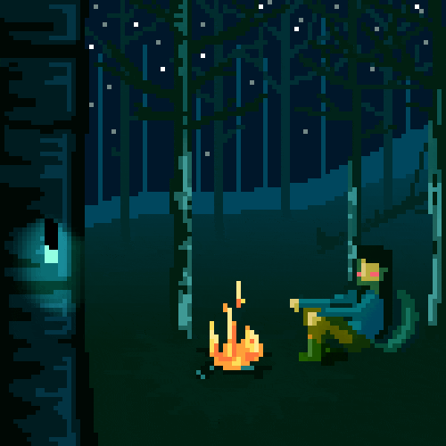
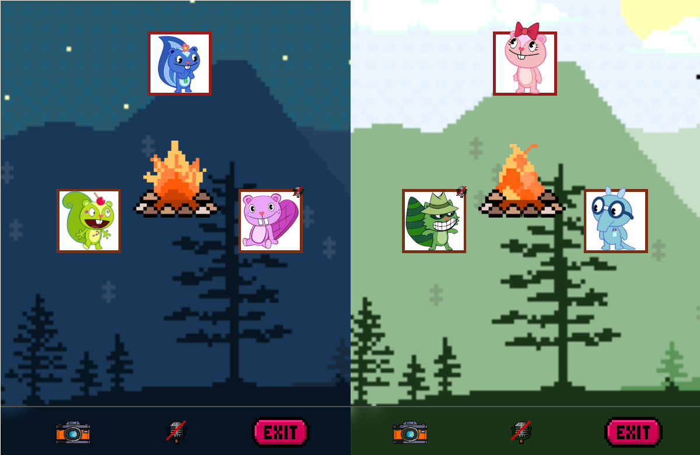

# Forest Meet

Link to the deployed project: [Forest Meet](https://forest-meet.com)

## About

Forest Meet is a project created using the [T3](https://create.t3.gg/) stack and integrated with [Agora.io](https://www.agora.io/) to facilitate convenient and high-quality video conferences. The platform offers a unique online meeting experience, blending cutting-edge technologies with the warm atmosphere of friendly gatherings around a campfire.

## Screenshots

## Project Scope

- [x] Geofetching
- [x] Balanced video quality
- [x] Check internet quality
- [x] Authorization with Google and Reddit
- [x] Control media devices (camera, microphone)
- [x] User media preview
- [x] Users around the fire
- [x] Join and leave sounds
- [x] Add custom icons

## In Progress

- [ ] Kick users from the room
- [ ] Disable microphone of remote users
- [ ] Change user info (name, avatar)
- [ ] Make random screenshots during a meet
- [ ] Correctly display meet duration
- [ ] Authorization with email and password
- [ ] Displaying user names
- [ ] Media device choice

## Nice to Have

- [ ] Meet chat
- [ ] Games inside a meet

## License

This project is licensed under the [MIT](./LICENSE) - see the [LICENSE](./LICENSE) file for details.

## How to Start

1. Make sure you have [Node.js](https://nodejs.org/) and [Yarn](https://yarnpkg.com/) installed.
2. Ensure you have [docker-compose](https://docs.docker.com/compose/) installed.
3. Run `yarn install` to install all dependencies.
4. Create a `.env` file in the root directory based on `.env.example`.
5. Run `yarn dev` to start the development server.
6. Run `yarn start` to start server.
7. Run `yarn build` to build the project.
8. Run `yarn db:studio` to open [Prisma Studio](https://www.prisma.io/studio).
